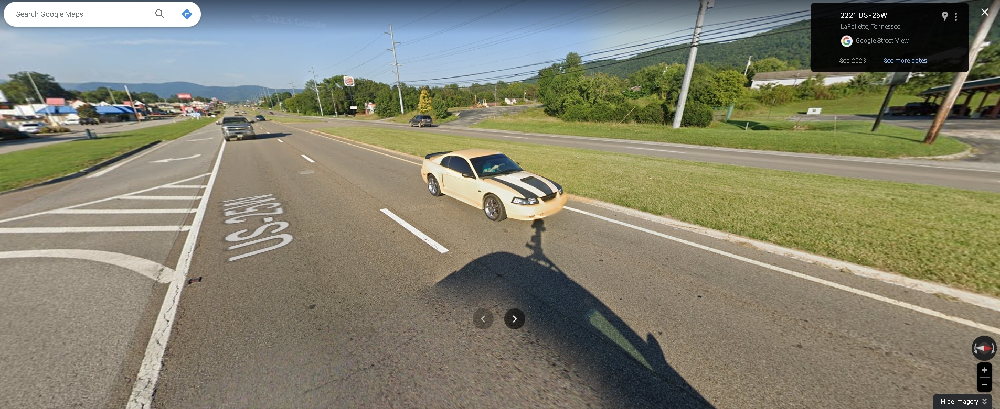

"# TBphotography" 
<!DOCTYPE html>
<html lang="en">
<head>
    <meta charset="UTF-8">
    <meta name="viewport" content="width=device-width, initial-scale=1.0">
    <title>TBPhotography Portfolio</title>
    <link rel="stylesheet" href="styles.css">
    <!-- Add any additional libraries or stylesheets here -->
</head>
<body>
    <header class="header">
        <nav class="navbar">
            

                

                    <h1>TBphotography</h1>
                

                

                    <ul>
                        <li><a href="#home">Home</a></li>
                        <li><a href="#portfolio">Portfolio</a></li>
                        <li><a href="#about">About</a></li>
                        <li><a href="#contact">Contact</a></li>
                    </ul>
                

            

        </nav>
        

            

                <h1></h1>
                
Explore my portfolio and let the images speak for themselves.

            

        

    </header>

    <section id="portfolio" class="portfolio">
        

            <h2>Portfolio</h2>
            <!-- Gallery/Grid of Photographs --> 
            

                <!-- Photo items with hover effect -->
            

        

    </section>

    <section id="about" class="about">
        

            <h2>About Us</h2>
            
Welcome to TBphotography, where every moment is captured with passion and creativity. Based in the picturesque town of Caryville, Tennessee, we specialize in crafting timeless memories through the lens of our camera.

At TBphotography, we believe that every click of the shutter is an opportunity to tell a story. Whether it's a candid moment shared between loved ones, the breathtaking beauty of nature, or the vibrant energy of a special event, we strive to encapsulate the essence of each moment in stunning imagery.

Our approach to photography is deeply rooted in authenticity and connection. We aim to create a comfortable and relaxed environment for our clients, allowing their true personalities to shine through in every photograph. From intimate portraits to lively celebrations, we are committed to delivering images that evoke emotion and preserve memories for a lifetime.

Led by [Your Name], our team is dedicated to providing exceptional service and personalized attention to each and every client. With a keen eye for detail and a passion for creativity, we go above and beyond to ensure that every photo captures the essence of the moment in its purest form.

Thank you for considering TBphotography to document your special moments. We look forward to creating beautiful memories together.

        

    </section>

    <section id="contact" class="contact">
        

            <h2>Contact Us</h2>
            
Email: Travisbowling103@gmail.com

			
Phone: 423-494-0822

            <!-- Contact Form -->
        

    </section>

    <footer class="footer">
        

            
&copy; 2024 TBphotography. All Rights Reserved.

            <!-- Social Media Links -->
        

    </footer>

    <!-- JavaScript for interactivity (if needed) -->
</body>
</html>
